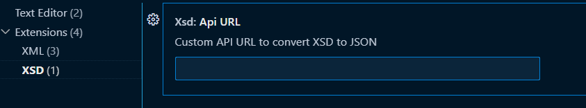

# XSD Essentials
This is VS Code Extension to Convert any XSD to JSON

  

 

## Features
* Convert any XSD to JSON

## Shortcut Keys
CTRL+ALT+J

## Requirements

It require internet access to call "https://www.pixelbyaj.com/api/XsdToJson" API

## Extension Settings
If you like to add your own custom API URL please add to VS Code settings through the `Xsd.apiURL`.

For example:

This extension contributes the following settings:

* `Xsd.apiURL`: 'Your CUSTOM API URL'.

