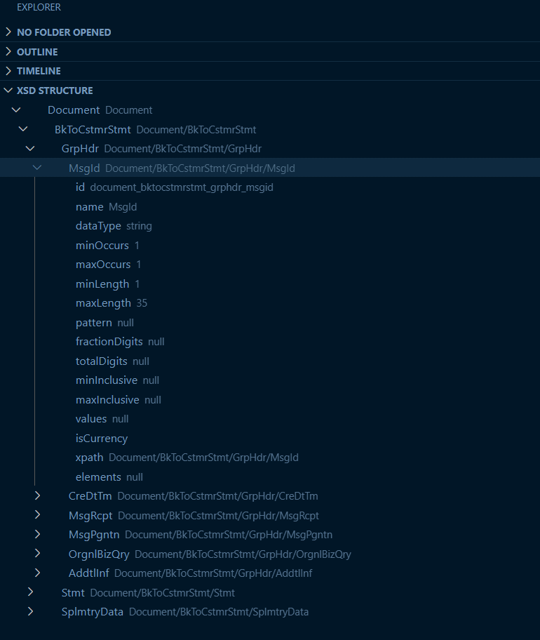

# XSD Essentials
This is VS Code Extension to Convert any XSD to JSON

  

 

## Features
* Convert any XSD to JSON
* Tree View as XSD STRUCTURE in Explorer 
* **(New)** Offline conversion

## Shortcut Keys
* CTRL+ALT+J (Convert to JSON)
* CTRL+ALT+F (Convert to XSD Tree Structure)

## Requirements

It require internet access.

## Extension Settings
If you like to add your own custom API URL please add to VS Code settings through the `Xsd.apiURL`.

